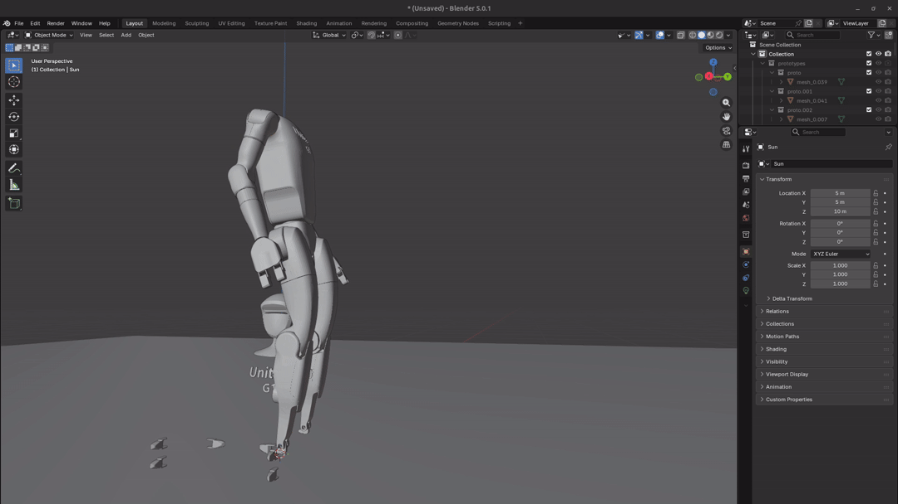

# Claude Blender Newton Experiment

NOTE: all code and documentation in this project generated with AI, through Claude. A fun experiment

A real-time physics simulation and visualization system that combines Newton physics engine with Blender for rendering and RL policy control for the Unitree G1 humanoid robot.



## Overview

This project demonstrates a socket-based IPC architecture connecting:
- **Newton Physics Engine**: Running physics simulation with RL policy control
- **Blender**: Real-time visualization of the USD robot model
- **Unitree G1 Robot**: 29-DOF humanoid robot model with RL policies

The system automatically manages the physics simulation, applies learned control policies, and visualizes the results in Blender in real-time.

## Features

- Real-time physics simulation with Newton engine
- RL policy-based robot control (23-DOF and 29-DOF configurations)
- Socket-based communication between physics and visualization
- Automatic simulation restart on robot rest detection
- USD-based robot model with full articulation

## Prerequisites

- **Python 3.11+**
- **Blender** (with Python API support)
- **X Server** (for display, set via `DISPLAY` environment variable)

### Python Dependencies

- PyTorch
- NumPy
- PyYAML
- Newton Physics Engine

## Setup

1. Clone the repository:
```bash
git clone <repository-url>
cd claude_blender_newton_experiment
```

2. Create and activate a virtual environment:
```bash
python3 -m venv .venv
source .venv/bin/activate  # On Linux/Mac
# or
.venv\Scripts\activate  # On Windows
```

3. Install required Python packages:
```bash
pip install torch numpy pyyaml
# Install Newton physics engine (follow Newton's installation instructions)
```

4. Verify Blender installation:
```bash
blender --version
```

## Project Structure

```
.
├── blender_socket_client.py           # Blender client for visualization
├── newton_socket_server_with_policy.py # Physics server with RL policy
├── run_simulation.sh                   # Launch script
├── unitree_g1/                        # Robot model and assets
│   ├── usd/                           # USD robot models
│   ├── meshes/                        # Robot mesh files
│   ├── urdf/                          # URDF robot descriptions
│   ├── mjcf/                          # MuJoCo XML descriptions
│   └── rl_policies/                   # RL policy configurations
│       ├── g1_23dof.yaml              # 23-DOF policy config
│       └── g1_29dof.yaml              # 29-DOF policy config
└── README.md                          # This file
```

## Running the Simulation

### Quick Start

Simply run the provided shell script:

```bash
./run_simulation.sh
```

This will:
1. Set the display environment variable
2. Launch Blender with the simulation client
3. Automatically start the Newton physics server
4. Begin real-time visualization

### Manual Execution

If you need more control, you can run components separately:

1. Start the physics server:
```bash
python newton_socket_server_with_policy.py
```

2. In another terminal, launch Blender with the client:
```bash
export DISPLAY=:1  # Adjust as needed
blender --python blender_socket_client.py
```

### Configuration

The simulation uses the Unitree G1 robot with different DOF configurations:
- **23-DOF**: Simplified model (legs + basic arms + waist)
- **29-DOF**: Full model (legs + full arms + full waist)

RL policy configurations are located in `unitree_g1/rl_policies/`.

## How It Works

1. **Blender Client** (`blender_socket_client.py`):
   - Launches Newton physics server as subprocess
   - Connects via socket on localhost:9999
   - Loads USD robot model into Blender
   - Receives transform updates from physics engine
   - Updates Blender scene in real-time

2. **Newton Server** (`newton_socket_server_with_policy.py`):
   - Initializes physics simulation
   - Loads RL policy for robot control
   - Runs physics steps and applies policy actions
   - Sends body transforms to Blender client
   - Detects rest state and restarts simulation

3. **Communication Protocol**:
   - Length-prefixed JSON messages over TCP socket
   - Message types: ready, request_step, update, reset

## Rest Detection

The simulation automatically detects when the robot comes to rest and restarts after 10 seconds to ensure continuous operation.

## License

This project is licensed under the Apache License 2.0. See [LICENSE](LICENSE) for details.

The Unitree G1 robot models are provided by Unitree Robotics and are subject to their own licensing terms. See `unitree_g1/LICENSE` for details.

## Troubleshooting

### Display Issues
If you encounter display errors, ensure your `DISPLAY` environment variable is set correctly:
```bash
export DISPLAY=:0  # Or :1, depending on your system
```

### Socket Connection Errors
- Ensure port 9999 is not in use by another application
- Check firewall settings if running across different machines

### Blender Python Module Issues
Make sure you're using Blender's built-in Python or that your Python environment is compatible with Blender's Python API.

## Credits

- **Unitree G1 Robot Model**: [Unitree Robotics](https://www.unitree.com/)
- **Newton Physics Engine**: Project Newton
- **Blender**: Open source 3D creation suite

## Contributing

Contributions are welcome! Please feel free to submit issues or pull requests.
